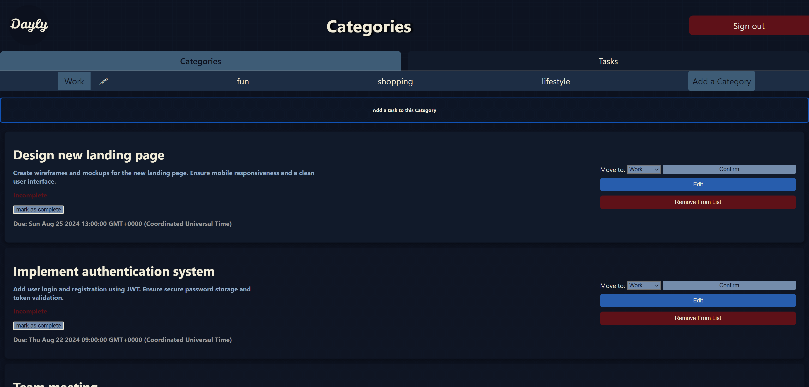

 

#    ***Dayly***  

***Dayly*** is a *daily task management web app* that helps the ***User*** track their ***Tasks*** and organize them in ***Categories***, providing the user with a clean and dynamic workspace. this web app allows users to create Tasks, edit them, mark them complete or incomplete, delete them, and move them between ***Categories***.

The three Main Elements of this web app are ***Tasks***, ***Categories***, and of course the ***User***.

### Tasks:
Users can add tasks to their task list. After adding a task they have access to move (*to a category*), modify, or delete these tasks. each task has the following properties:
- Title (the title of that task)
- Description (a brief description of the ask)
- Completion status (complete/incomplete)
- Due date (optional property)
- Owner (which is the user that creates this task)

### Categories:
Users can add Categories to their Category Bar, after adding a Category they have access to add 
tasks to it, modify or delete that Category. Each category has the following properties:
- Title (the title of that Category)
- Task List (a list of the tasks that are added to the Category)
- Owner (which is the user that creates this task)

### User
This web app was built with the user's workspace privacy in scope. This means that the authentication for each user is verified and secured to ensure a private and functional user interface.

# Getting Started - click on the Logo below to visit the deployed app
### 

# Planning Material
- ### [Trello board](https://trello.com/b/OXb3IAQL/day-planner-project)

# Technologies Used

# Attributions
- ### Animations: [Animate.css](https://animate.style/)
- ### Fonts: [Google Fonts]('https://fonts.googleapis.com/css2?family=Gugi&family=Open+Sans:ital,wght@0,300..800;1,300..800&display=swap')
- ### Patterns: [Hero Patterns](https://heropatterns.com/)
- ### Favicon: [favicon](https://favicon.io/)

# Next Steps: 
- #### Color coding tasks according to their Due Date
- #### Implement external API (daily motivational quote)
- #### Implement a Timer for the user to time task completion  